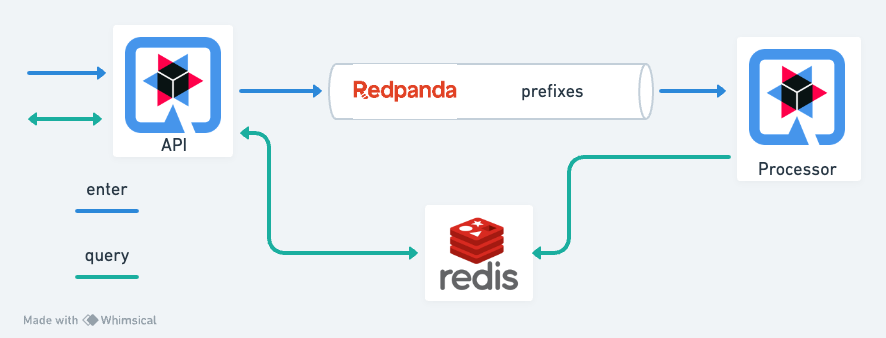
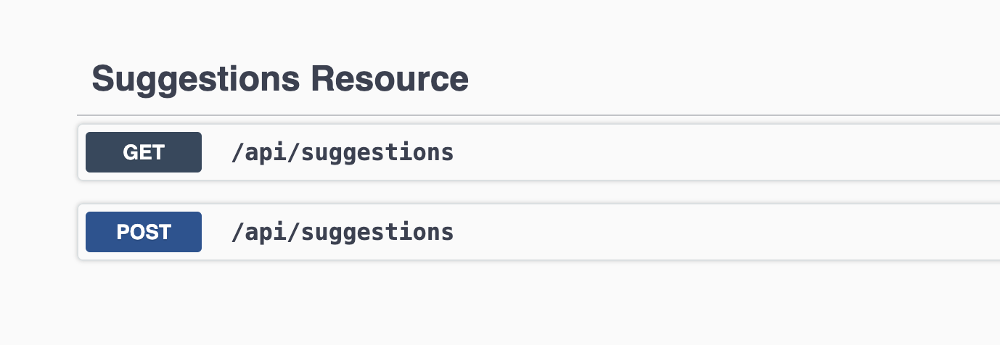
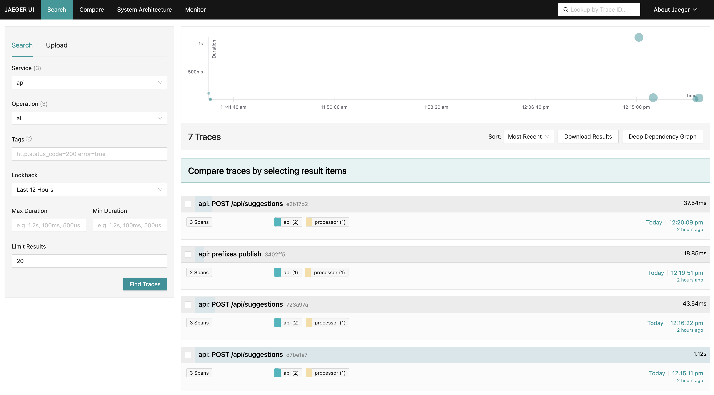
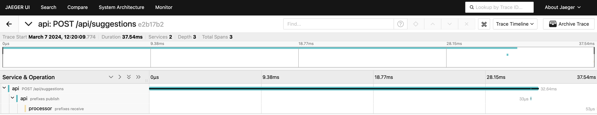

# Prefixy



Prefixy is an application that powers autocomplete suggestions. Suggestions dynamically update in response to user selection,
so users only see the most relevant data. Suggestions are stored in Redis in auto-complete suggestion dictionary. The user's selection is sent as an event to Redpanda.
Event processor processes events and updates data in Redis.

## Packaging and running the application
```shell script
git clone https://github.com/ivpal/Prefixy.git
cd Prefixy/
```
You need Java 21 or higher to package and run the application.

Run the application in dev mode:
```shell script
docker compose -f docker-compose.yml -f docker-compose.dev.yml up -d redpanda redis jaeger-all-in-one
./gradlew api:quarkusDev
./gradlew processor:quarkusDev
```

Run the application in containers:
```shell script
./gradlew api:imageBuild
./gradlew processor:imageBuild
docker compose up -d
```

## Usage
After launching the application, the swagger will be available via the link [http://localhost:8080/q/swagger-ui/#/](http://localhost:8080/q/swagger-ui/#/)


If you want to see traces, go to Jaeger UI via link [http://localhost:16686](http://localhost:16686)




